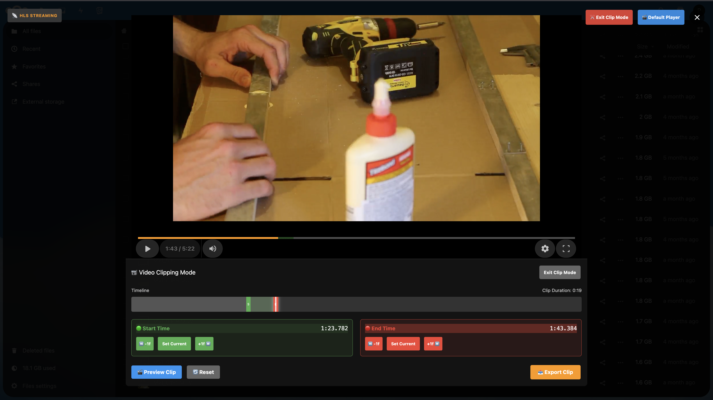
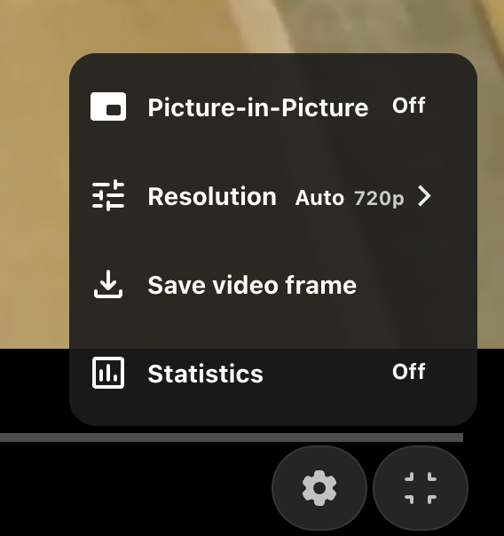
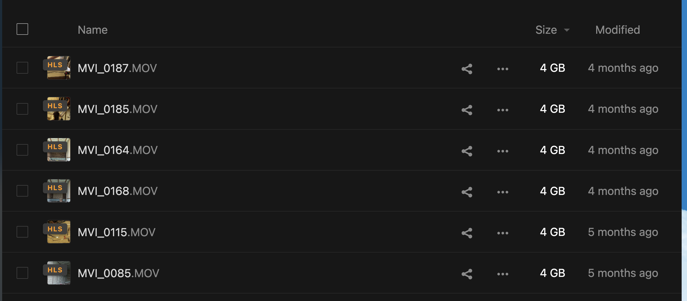
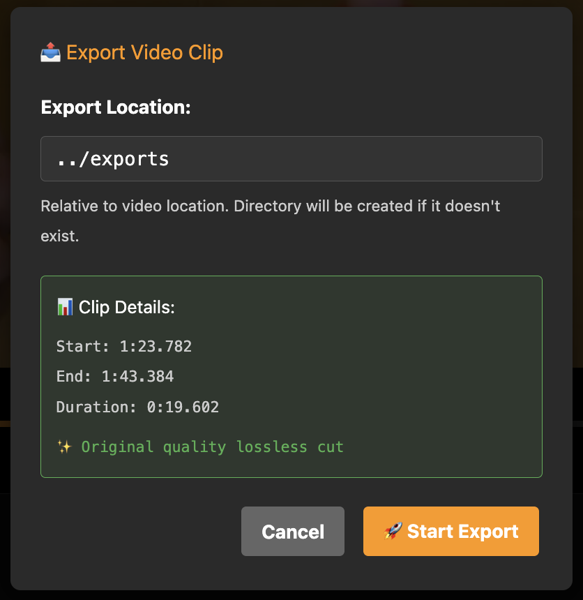
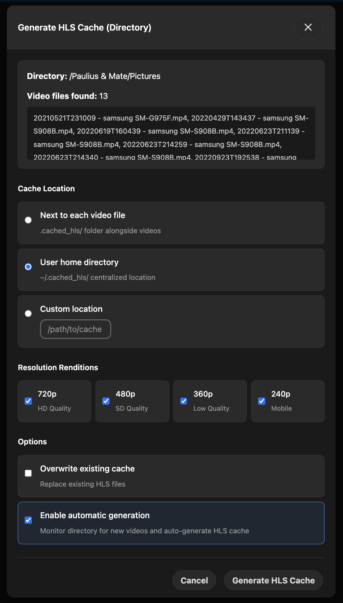
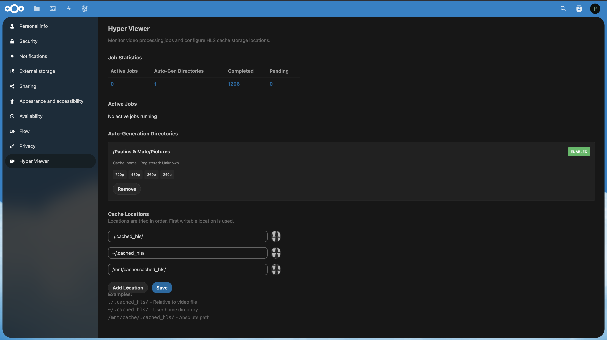

# Hyper Viewer

**Review footage instantly, choose highlights, and export only what you need in full quality.**

Professional video processing toolkit for Nextcloud. Automatically generates HLS streams for smooth remote video review, then extract and download specific clips in original quality without re-encoding. Stop downloading entire 50GB files just to get a 30-second segment - review remotely, clip precisely, export losslessly. Perfect for videographers managing large footage libraries.


*Frame-accurate clip selection with real-time preview*


*Adaptive bitrate streaming with Shaka Player*

## Features

- 🎬 **Automatic HLS Proxy Generation** - Background jobs create adaptive bitrate streams (720p, 480p, 360p, 240p) automatically for your directories
- 🎞️ **Shaka Player Integration** - Professional HLS video playback interface
- 📱 **Mobile Friendly** - Responsive UI works on all devices

## Installation (No Build Required!)

1. ☁ Clone into your Nextcloud `apps` folder: `git clone https://github.com/irgipaulius/hyperviewer.git`
2. 🔧 Fix file ownership: `chown -R www-data:www-data hyperviewer/`
3. ✅ Enable the app through Nextcloud app management, and refresh the page
4. 🎉 Ready to use!

**Note**: Build files are committed, so no Node.js or build step required on server.

## Requirements

- Nextcloud 30+
- PHP 8.1+
- FFmpeg installed on server
- Sufficient disk space for HLS cache files

## Development

### Building (Webpack - Current)
```bash
npm install
NODE_OPTIONS="--openssl-legacy-provider" npm run build
```

### Building (Vite - Faster Alternative)
```bash
npm install
npm run build:vite
```

### Watch Mode
```bash
npm run watch          # Webpack
npm run watch:vite     # Vite
```

### Code Quality
```bash
composer install                # Install PHP tools
composer cs:check               # Check code style
composer cs:fix                 # Fix code style
composer psalm                  # Static analysis
composer test:unit              # Run tests
```

## Configuration

In Nextcloud, navigate to **Settings → Personal → Hyper Viewer** to:
- Configure HLS cache location
- Monitor active FFmpeg jobs with real-time progress
- Manage auto-generation directories
- View job statistics

## How It Works

### HLS Streaming
1. Right-click any MOV/MP4 file → **Generate HLS Cache**
   > alternatively, right-click a directory which recursively generates HLS cache for all MOV/MP4 files in it
2. Select quality variants (720p, 480p, 360p, 240p)
3. FFmpeg generates adaptive HLS stream in background
4. Click your gigantic MOV/MP4 file and enjoy HLS video stream within just a second!
5. Video seeks, quality switching, and mobile playback all supported

### Video Clipping & Export
1. Open any video file in the HLS player
2. Use the timeline to find your desired start and end points
3. Click **Export Clip** to extract just that segment
4. Original quality export using lossless stream copy (no re-encoding)
5. Download only the clip you need - not the entire 50GB file!

## Screenshots Gallery

<details>
<summary>Click to view more screenshots</summary>






</details>

## License

AGPL-3.0-or-later

## Links

- 🐛 [Issues](https://github.com/irgipaulius/hyperviewer/issues)
- 👨‍💻 [GitHub](https://github.com/irgipaulius/hyperviewer)
